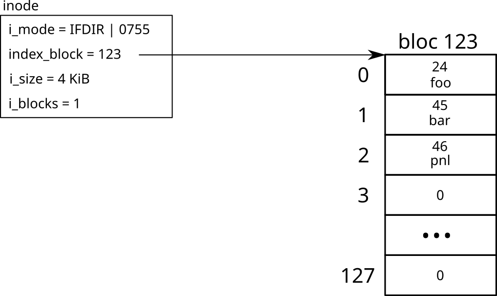
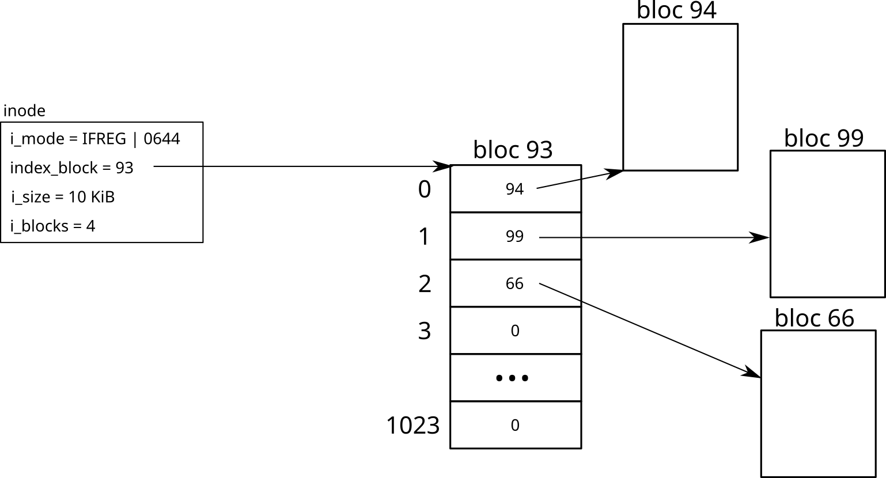
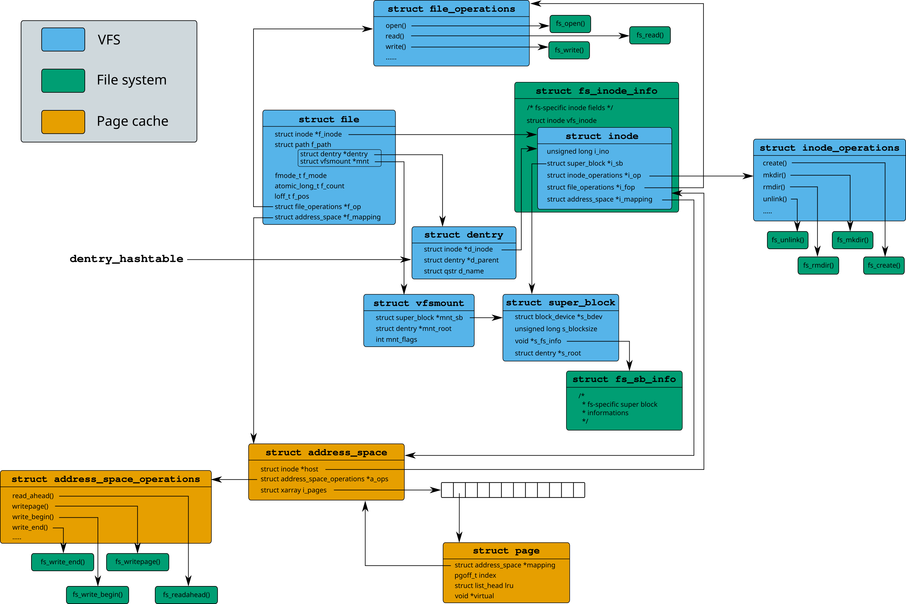

# ouiche_fs - a simple educational filesystem for Linux

The main objective of this project is to provide a simple Linux filesystem for students to build on.

## Summary

- [Usage](#Usage)
- [Design](#Design)
- [Roadmap](#Roadmap)

## Usage

### Building the kernel module

You can build the kernel module for your currently running kernel with `make`. If you wish to build the module against a different kernel, run `make KERNELDIR=<path>`. Insert the module with `insmod ouichefs.ko`.

This code was tested on a 6.5.7 kernel.

### Formatting a partition

First, build `mkfs.ouichefs` from the mkfs directory. Run `mkfs.ouichefs img` to format img as a ouiche_fs partition. For example, create a zeroed file of 50 MiB with `dd if=/dev/zero of=test.img bs=1M count=50` and run `mkfs.ouichefs test.img`. You can then mount this image on a system with the ouiche_fs kernel module installed.

### Creating a partition

First create a file to use as a partition.

```bash
cd mkfs
make img
```

Then you'll find `test.img` file, that you can copy to your VM to mount it.

### Mounting the partition

```bash
mkdir /mnt/disk
losetup /dev/loop0 test.img
mount -o loop /dev/loop0 /mnt/disk
```

then you can use the filesystem as usual

`cd /mnt/disk`

### Interacting with the filesystem

#### Hot-swappable Eviction Policies

Eviction policies that decide which files should be removed can be implemented in other kernel modules.
Such module has to have a `struct ouichefs_eviction_policy`
and then register it using the functions from [`eviction_policy.h`](eviction_policy/eviction_policy.h).

After inserting the module, the eviction policy can be changed by writing the name
of the policy to `/proc/ouiche/eviction`.

```bash
echo -n "lru" > /proc/ouiche/eviction
```

List of registered eviction policies can be found in also `/proc/ouiche/eviction`.

```bash
cat /proc/ouiche/eviction
Following eviction policies are available:
...
```

#### Manual eviction

ouiche_fs frees up space automatically, but you can also run the current eviction policy manually.

Because there can be multiple partitions using ouiche_fs, you need to specify the partition you want to evict from.

First list all the partitions:

```bash
cat /proc/ouiche/partitions
Following partitions use ouiche_fs:
0:/dev/loop1
```

Then, you clean the partition by writing its name to `/proc/ouiche/clean`.

```bash
echo -n "0:/dev/loop1" > /proc/ouiche/clean
```

## Design

This filesystem does not provide any fancy feature to ease understanding.

### Partition layout

    +------------+-------------+-------------------+-------------------+-------------+
    | superblock | inode store | inode free bitmap | block free bitmap | data blocks |
    +------------+-------------+-------------------+-------------------+-------------+

Each block is 4 KiB large.

### Superblock

The superblock is the first block of the partition (block 0). It contains the partition's metadata, such as the number of blocks, number of inodes, number of free inodes/blocks, ...

### Inode store

Contains all the inodes of the partition. The maximum number of inodes is equal to the number of blocks of the partition. Each inode contains 40 B of data: standard data such as file size and number of used blocks, as well as a ouiche_fs-specific field called `index_block`. This block contains:

- for a directory: the list of files in this directory. A directory can contain at most 128 files, and filenames are limited to 28 characters to fit in a single block.



- for a file: the list of blocks containing the actual data of this file. Since block IDs are stored as 32-bit values, at most 1024 links fit in a single block, limiting the size of a file to 4 MiB.



### Inode and block free bitmaps

These two bitmaps track if inodes/blocks are used or not.

### Data blocks

The remainder of the partition is used to store actual data on disk.

### Data structure relations in the Linux kernel



## Roadmap

### Current features

#### Directories

- Creation and deletion
- List content
- Renaming

#### Regular files

- Creation and deletion
- Reading and writing (through the page cache)
- Renaming

### Future features

- Hard and symbolic link support
